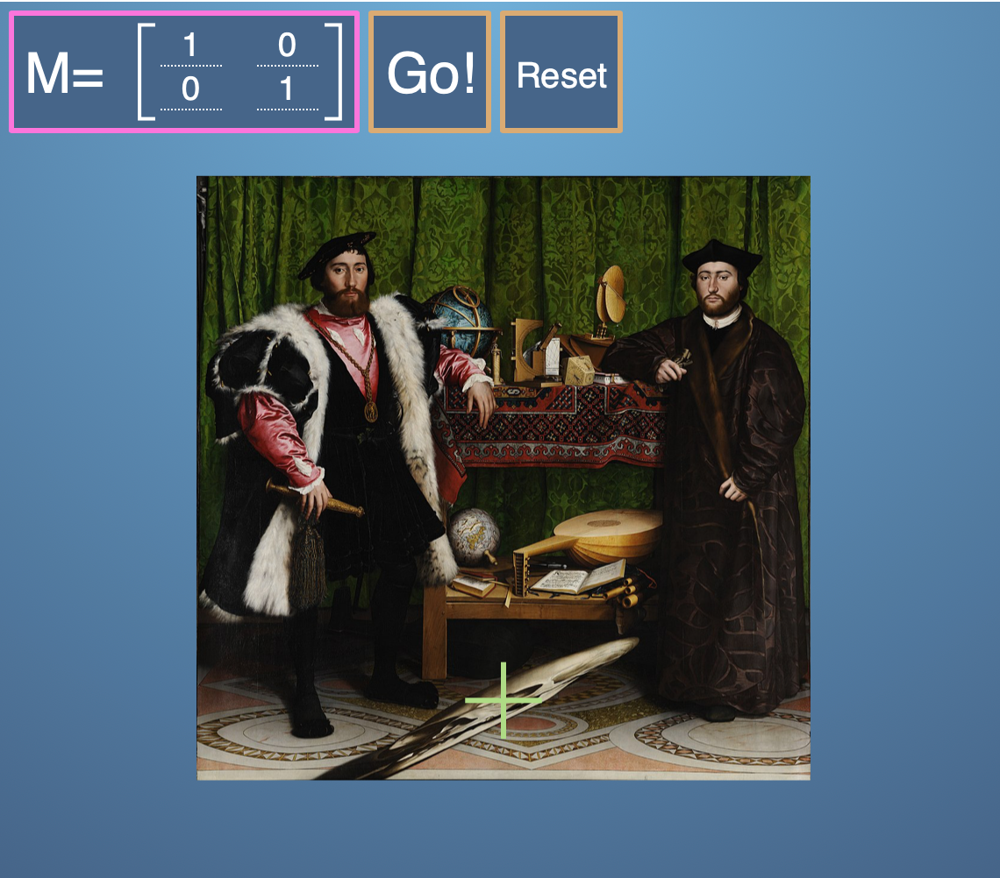

# Table of Contents
## Overview

 Need to resize image.

[Insert Image with Caption]

[Need to continue editing.] Introduction to Linear Algebra: In this first module we look at how linear algebra is relevant to machine learning and data science. Then we'll wind up the module with an initial introduction to vectors. Throughout, we're focussing on developing your mathematical intuition, not of crunching through algebra or doing long pen-and-paper examples. For many of these operations, there are callable functions in Python that can do the adding up - the point is to appreciate what they do and how they work so that, when things go wrong or there are special cases, you can understand why and what to do.        

## Assignments
- Identifying Singular Matrices ([Solution](https://github.com/jessxphil/mathematics-of-machine-learning-linear-algebra/blob/master/assignment-1/id-singular-matrices.ipynb))([Write Up](https://medium.com/@jessxphil))
- Gram-Schmidt process ([Solution](https://github.com/jessxphil/mathematics-of-machine-learning-linear-algebra/blob/master/assignment-2/gram-schmidt-process.ipynb))([Write Up](https://medium.com/@jessxphil))
- Reflexing Bear([Solution](https://github.com/jessxphil/mathematics-of-machine-learning-linear-algebra/blob/master/assignment-3/reflecting-bear.ipynb))([Write Up](https://medium.com/@jessxphil))
- Google Page Rank ([Solution](https://github.com/jessxphil/mathematics-of-machine-learning-linear-algebra/tree/master/assignment-4))([Write Up](https://medium.com/@jessxphil))  
